# [📈 Live Status](https://conuti-das.github.io/status-lfrcs): <!--live status--> **🟧 Partial outage**

This repository contains the open-source uptime monitor and status page for [DaS](https://conuti.de), powered by [Upptime](https://github.com/upptime/upptime).

With [Upptime](https://upptime.js.org), you can get your own unlimited and free uptime monitor and status page, powered entirely by a GitHub repository. We use [Issues](https://github.com/conuti-das/status-lfrcs/issues) as incident reports, [Actions](https://github.com/conuti-das/status-lfrcs/actions) as uptime monitors, and [Pages](https://conuti-das.github.io/status-lfrcs) for the status page.

<!--start: status pages-->
<!-- This summary is generated by Upptime (https://github.com/upptime/upptime) -->
<!-- Do not edit this manually, your changes will be overwritten -->
<!-- prettier-ignore -->
| URL | Status | History | Response Time | Uptime |
| --- | ------ | ------- | ------------- | ------ |
|  CC - API GATEWAY | 🟩 Up | [cc-api-gateway.yml](https://github.com/conuti-das/status-lfrcs/commits/HEAD/history/cc-api-gateway.yml) | 

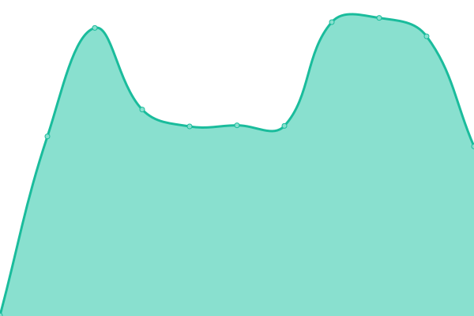 457ms
     
 | 

<a href="https://conuti-das.github.io/status-lfrcs/history/cc-api-gateway">100.00%</a>
    

|  CC - API PORTAL | 🟩 Up | [cc-api-portal.yml](https://github.com/conuti-das/status-lfrcs/commits/HEAD/history/cc-api-portal.yml) | 

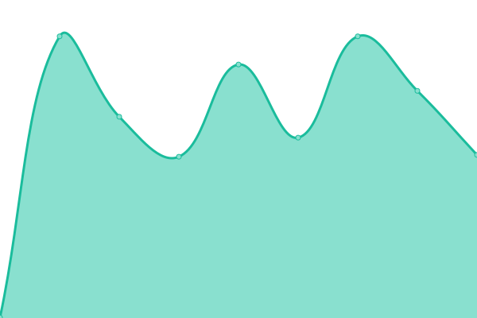 473ms
     
 | 

<a href="https://conuti-das.github.io/status-lfrcs/history/cc-api-portal">100.00%</a>
    

|  CC - API MANAGEMENT | 🟩 Up | [cc-api-management.yml](https://github.com/conuti-das/status-lfrcs/commits/HEAD/history/cc-api-management.yml) | 

 229ms
     
 | 

<a href="https://conuti-das.github.io/status-lfrcs/history/cc-api-management">100.00%</a>
    

|  CC - BACKOFFICE API | 🟩 Up | [cc-backoffice-api.yml](https://github.com/conuti-das/status-lfrcs/commits/HEAD/history/cc-backoffice-api.yml) | 

 485ms
     
 | 

<a href="https://conuti-das.github.io/status-lfrcs/history/cc-backoffice-api">100.00%</a>
    

|  CC - BACKOFFICE WEB | 🟩 Up | [cc-backoffice-web.yml](https://github.com/conuti-das/status-lfrcs/commits/HEAD/history/cc-backoffice-web.yml) | 

 419ms
     
 | 

<a href="https://conuti-das.github.io/status-lfrcs/history/cc-backoffice-web">100.00%</a>
    

|  CC - KEYCLOAK | 🟩 Up | [cc-keycloak.yml](https://github.com/conuti-das/status-lfrcs/commits/HEAD/history/cc-keycloak.yml) | 

 494ms
     
 | 

<a href="https://conuti-das.github.io/status-lfrcs/history/cc-keycloak">100.00%</a>
    

|  CC - NOCODB API | 🟩 Up | [cc-nocodb-api.yml](https://github.com/conuti-das/status-lfrcs/commits/HEAD/history/cc-nocodb-api.yml) | 

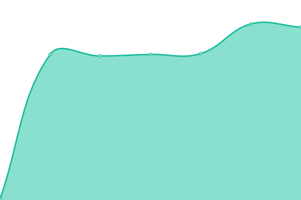 224ms
     
 | 

<a href="https://conuti-das.github.io/status-lfrcs/history/cc-nocodb-api">100.00%</a>
    

|  CC - PMON API | 🟩 Up | [cc-pmon-api.yml](https://github.com/conuti-das/status-lfrcs/commits/HEAD/history/cc-pmon-api.yml) | 

 505ms
     
 | 

<a href="https://conuti-das.github.io/status-lfrcs/history/cc-pmon-api">100.00%</a>
    

|  [CC - BACKOFFICE POC](https://dev.lief.macoapp.de) | 🟩 Up | [cc-backoffice-poc.yml](https://github.com/conuti-das/status-lfrcs/commits/HEAD/history/cc-backoffice-poc.yml) | 

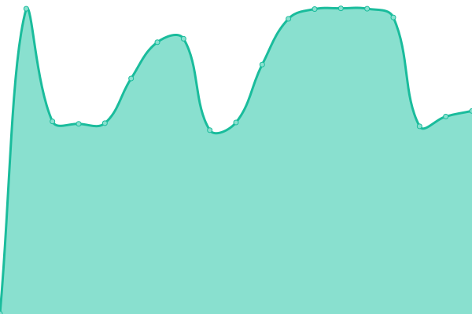 699ms
     
 | 

<a href="https://conuti-das.github.io/status-lfrcs/history/cc-backoffice-poc">100.00%</a>
    

|  CC - RABBITMQ MANAMGEMENT | 🟩 Up | [cc-rabbitmq-manamgement.yml](https://github.com/conuti-das/status-lfrcs/commits/HEAD/history/cc-rabbitmq-manamgement.yml) | 

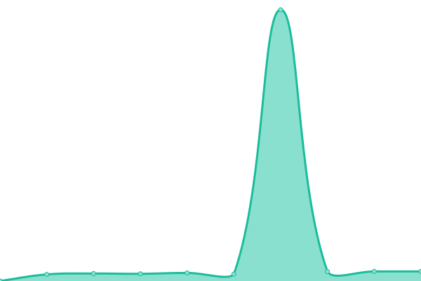 451ms
     
 | 

<a href="https://conuti-das.github.io/status-lfrcs/history/cc-rabbitmq-manamgement">100.00%</a>
    

|  MCS - ADMIN UI | 🟩 Up | [mcs-admin-ui.yml](https://github.com/conuti-das/status-lfrcs/commits/HEAD/history/mcs-admin-ui.yml) | 

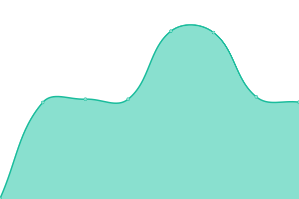 366ms
     
 | 

<a href="https://conuti-das.github.io/status-lfrcs/history/mcs-admin-ui">100.00%</a>
    

|  MCS - PORTAL UI | 🟩 Up | [mcs-portal-ui.yml](https://github.com/conuti-das/status-lfrcs/commits/HEAD/history/mcs-portal-ui.yml) | 

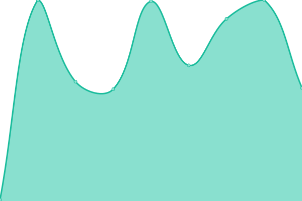 116ms
     
 | 

<a href="https://conuti-das.github.io/status-lfrcs/history/mcs-portal-ui">100.00%</a>
    

|  MCS - BUILD INFO UI | 🟩 Up | [mcs-build-info-ui.yml](https://github.com/conuti-das/status-lfrcs/commits/HEAD/history/mcs-build-info-ui.yml) | 

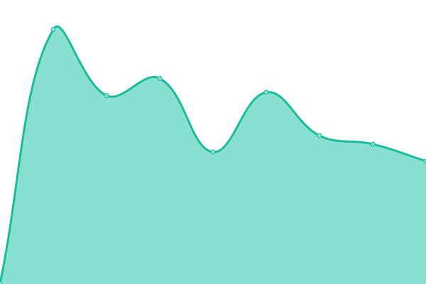 470ms
     
 | 

<a href="https://conuti-das.github.io/status-lfrcs/history/mcs-build-info-ui">100.00%</a>
    

|  MCS - UI | 🟩 Up | [mcs-ui.yml](https://github.com/conuti-das/status-lfrcs/commits/HEAD/history/mcs-ui.yml) | 

 117ms
     
 | 

<a href="https://conuti-das.github.io/status-lfrcs/history/mcs-ui">100.00%</a>
    

|  MPS - CAMUNDA | 🟩 Up | [mps-camunda.yml](https://github.com/conuti-das/status-lfrcs/commits/HEAD/history/mps-camunda.yml) | 

 449ms
     
 | 

<a href="https://conuti-das.github.io/status-lfrcs/history/mps-camunda">100.00%</a>
    

|  MPS - DATAKEEPER | 🟩 Up | [mps-datakeeper.yml](https://github.com/conuti-das/status-lfrcs/commits/HEAD/history/mps-datakeeper.yml) | 

 420ms
     
 | 

<a href="https://conuti-das.github.io/status-lfrcs/history/mps-datakeeper">100.00%</a>
    

|  MPS - DATAKEEPER API SEARCH | 🟩 Up | [mps-datakeeper-api-search.yml](https://github.com/conuti-das/status-lfrcs/commits/HEAD/history/mps-datakeeper-api-search.yml) | 

 128ms
     
 | 

<a href="https://conuti-das.github.io/status-lfrcs/history/mps-datakeeper-api-search">100.00%</a>
    

|  MPS - DK PROCESS HISTORY | 🟩 Up | [mps-dk-process-history.yml](https://github.com/conuti-das/status-lfrcs/commits/HEAD/history/mps-dk-process-history.yml) | 

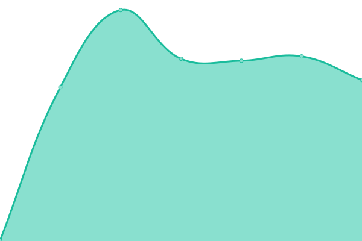 390ms
     
 | 

<a href="https://conuti-das.github.io/status-lfrcs/history/mps-dk-process-history">100.00%</a>
    

|  MPS - SAP D1V KONNEKTOR TEST | 🟩 Up | [mps-sap-d1-v-konnektor-test.yml](https://github.com/conuti-das/status-lfrcs/commits/HEAD/history/mps-sap-d1-v-konnektor-test.yml) | 

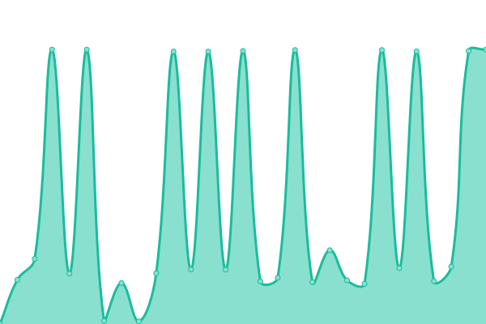 5347ms
     
 | 

<a href="https://conuti-das.github.io/status-lfrcs/history/mps-sap-d1-v-konnektor-test">99.38%</a>
    

|  MPS - PROCESS HISTORY | 🟩 Up | [mps-process-history.yml](https://github.com/conuti-das/status-lfrcs/commits/HEAD/history/mps-process-history.yml) | 

 529ms
     
 | 

<a href="https://conuti-das.github.io/status-lfrcs/history/mps-process-history">100.00%</a>
    

|  MPS - NIFI | 🟩 Up | [mps-nifi.yml](https://github.com/conuti-das/status-lfrcs/commits/HEAD/history/mps-nifi.yml) | 

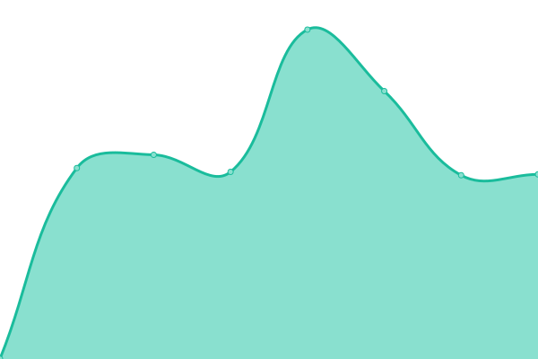 998ms
     
 | 

<a href="https://conuti-das.github.io/status-lfrcs/history/mps-nifi">100.00%</a>
    

|  MPS - TASKER | 🟩 Up | [mps-tasker.yml](https://github.com/conuti-das/status-lfrcs/commits/HEAD/history/mps-tasker.yml) | 

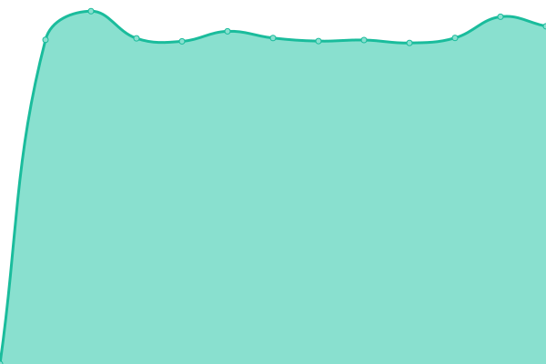 453ms
     
 | 

<a href="https://conuti-das.github.io/status-lfrcs/history/mps-tasker">100.00%</a>
    

|  MPS - TESTPROCESS | 🟥 Down | [mps-testprocess.yml](https://github.com/conuti-das/status-lfrcs/commits/HEAD/history/mps-testprocess.yml) | 

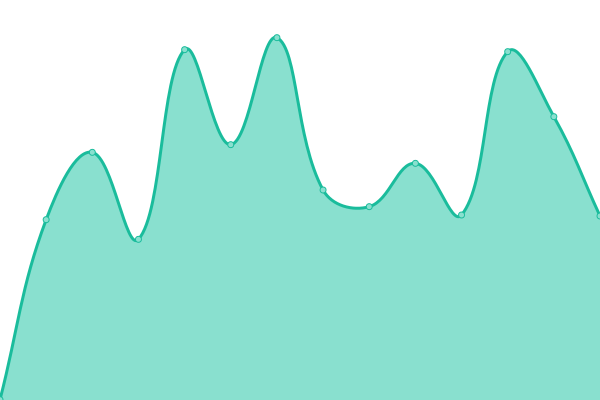 677ms
     
 | 

<a href="https://conuti-das.github.io/status-lfrcs/history/mps-testprocess">73.40%</a>
    

|  MPS - TEMPLATER | 🟩 Up | [mps-templater.yml](https://github.com/conuti-das/status-lfrcs/commits/HEAD/history/mps-templater.yml) | 

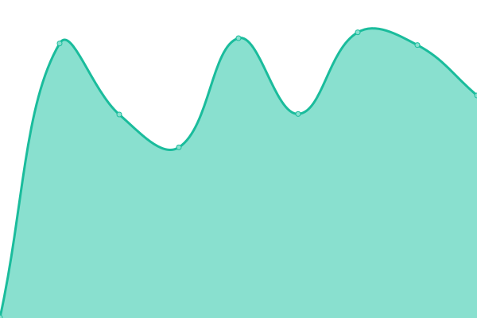 423ms
     
 | 

<a href="https://conuti-das.github.io/status-lfrcs/history/mps-templater">100.00%</a>
    

<!--end: status pages-->

[**Visit our status website →**](https://conuti-das.github.io/status-lfrcs)

## 📄 License

- Powered by: [Upptime](https://github.com/upptime/upptime)
- Code: [MIT](./LICENSE) © [Anand Chowdhary](https://anandchowdhary.com), supported by [Pabio](https://pabio.com)
- Data in the `./history` directory: [Open Database License](https://opendatacommons.org/licenses/odbl/1-0/)
